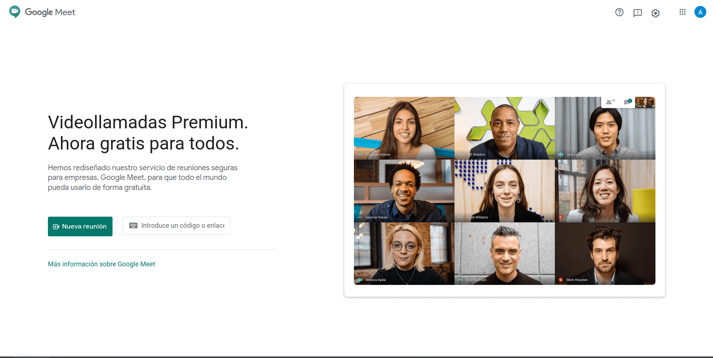
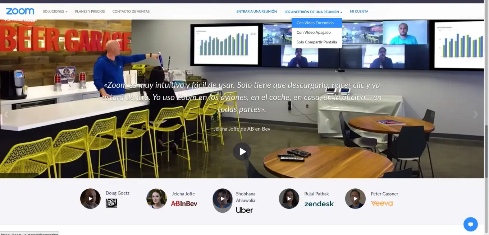
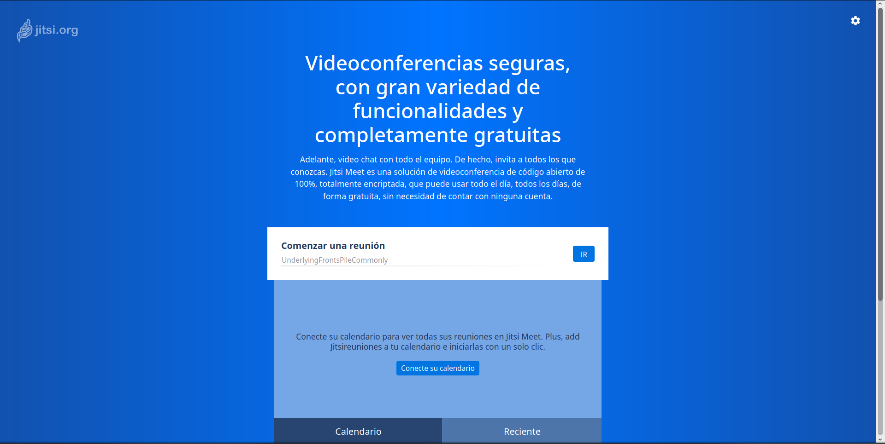

### Nuevas formas de enseñar

Aunque la educación mediante plataformas, videoconferencias y recursos en línea no es nueva, había sido más bien relegada a la educación a distancia, a sistemas abiertos, o era vista como un complemento a la educación tradicional.

Aún así en los últimos años, la tecnificación de la escuelas ha ido incrementandose, reflejando el impacto de las TICs, y la importancia que representa el saber digital dentro de las competencias requeridas actualmente.

La pandemia de COVID-19 llegó para acelerar éste proceso: Paso de ser una alternativa, a ser la opción _de facto_ para impartir clases dentro del distanciamiento social.

Plataformas como Zoom, Microsoft Teams, y Google Meet; con la capacidad de hacer videoconferencias, interactuar con los alumnos, y agendar con fecha y hora, han sido líderes
en ésta transformación.

No solo han encontrado un lugar en el ámbito **educativo**, si no también en el **laboral** e incluso en el **social**.

Aún sí alguno de estos nombres no nos resulta familiar, no hay una gran diferencia entre lo que ofrecen: Son plataformas que permiten hacer videoconferencias (la evolución de una videollamada en grupo), así como favorecer la interacción con algunos elementos como compartir la pantalla, chatear con los participantes, y alzar la mano para compartir dudas.

### Crear mi propia clase en línea: Webinars

Considerando el impacto de las plataformas, y la necesidad de crear nuevos canales de comunicación, nace una duda lógica: ¿Cómo puedo **yo** participar?

En realidad muchas veces ésta pregunta no es complicada por la falta de opciones, en realidad lo que genera confusión es el exceso de éstas. Existen una gran cantidad de soluciones para cada caso. Desde vídeos en vivo en Facebook o Instagram Live, pasando por el clásico YouTube, el relegado Skype, y los más personales Messenger Rooms, hasta las plataformas de escala empresarial, como lo son los servicios de paga de Zoom o Cisco Webex.

No vamos a detallar aquí la diferencia entre estos, vamos a acotar a lo que nos interesa.

Quizás una clase de cocina, una demostración de yoga, un concierto personal o un servicio educativo a pequeña escala. Las razones para querer impartir una videoconferencia, buscando una alternativa que no nos genere costos, son amplias. Afortunadamente para todas ellas es posible dar una sencilla solución.

Las empresas, los _freelancers_, vendedores de cursos, programadores, entre otros han popularizado el término **_Webinar_**, que es la combinación de Web Seminar, ó Seminario Web. De cualquier manera es solo una forma llamativa de referirse a una videoconferencia, en la que en particular nos interesa la participación de un (o pocos) expositor, y el resto de los presentes como expectadores. Se diferencía de una llamada normal, puesto que no queremos que los espectadores tomen el control, ni nos interesa ver sus cámaras.

Es mucho más sencillo que nunca compartir nuestro conocimiento.

Asumiendo que tengamos listo nuestro tema, podemos proceder al área técnica.

[^1]

### Elegir nuestro público

Mucha de nuestra elección dependerá de a quién buscamos incluir en nuestra presentación. No es lo mismo hacer una exposición abierta para atraer seguidores en Facebook, que hacer una presentación de producto para nuestros clientes. Ni esperamos lo mismo que al dar una clase a estudiantes, sobre todo sí buscamos hacer un sistema de cobro por éstas clases.

A continuación haremos unas observaciones, y sus respectivas recomendaciones, al respecto.

---

#### Transmisión abierta

> Sí lo que buscamos es hacer una clase abierta, con el mayor alcance posible, tendremos que buscar opciones con gran alcance, pocos requisitos y en plataformas de uso común. En éste caso una buena alternativa sería hacer transmisiones en vivo en Facebook Live o en YouTube. Con la ventaja de que al concluir la transmisión podremos almacenar directamente el vídeo en éstas plataformas.

> Las desventajas que esto representa es que no tenemos un control estricto de los participantes, quienes pueden entrar o salir a lo largo de la misma sin ninguna restricción. Además de tener una interacción restringida a los comentarios.

---

#### Videoconferencia bajo registro

> Nuestro siguiente paso es una sesión más personal, ya sea porque necesitamos hacer un recuento de los invitados, porque no buscamos que sea tan abierta o porque tengamos un cupo límitado. Podemos empezar a hablar de plataformas más especificas. **Zoom, Google Meet, Skype** y **GoToMeeting** (todos en su capa gratuita) hacen su aparición. Tenemos algunas restricciónes como el límite de 100 (250 en caso de Google Meet) participantes, o la restricción de 40 minutos en sesión. Cabe destacar que Google ha quitado la restricción de tiempo hasta el 30 de
> septiembre de 2020.

> Una función que me parece relevante destacar de Zoom es que tiene la opción de silenciar a todos los participantes en conjunto, muy práctica cuando queremos hacer más una presentación que una videollamada.

> Sí no requerimos exceder estás límitantes, desde [asdrome][asdrome.digital] les recomendamos no quebrarse la cabeza e ir con Google Meet o Zoom. Ambos tienen un acceso bastante directo tanto para crear como para unirse a sesiones.

---

#### Webinar privado ó cursos de pago

> Llegados a éste punto, tenemos que considerar que dependiendo del nivel de profesionalización y los requerimientos partículares convendría considerar las opciones de pago de las plataformas anteriores, así con introducir **Microsoft Teams**, que es la versión evolucionada de Skype for Business, que agrega una serie de capacidades más relacionadas a cursos dentro de una empresa, y flujos de equipos de trabajo.

> Tanto Zoom como Google Meet tienen versiones pagas, que agregan distintos beneficios. Cabe recalcar que Zoom ofrece planes distintos para reuniones más grandes **ó** para seminarios. De la misma manera GoToMeetings tiene la versión especializada en seminarios Web, **GoToWebinars**.

> Valdría la pena que sí buscas necesidades más exigentes compares los planes de cada uno, pero vamos aquí a presentar una opción gratuita que no tiene nada que pedirles a las de pago.

### Jitsi Meet

**Jitsi Meet** es una plataforma de videoconferencias, igual que Zoom, pero construida sobre un modelo abierto. No requiere cuentas, y es **completamente gratuita**.

No vamos a mentir, es nuestra favorita por varios motivos. Primero porque en [asdrome][asdrome.digital] somos partidiarios de los proyectos de código abierto, del que Jitsi forma parte. De hecho pueden encontrar sus proyectos en [Github](https://github.com/jitsi). Segundo porque ofrece videoconferencias de calidad, totalmente gratis, balanceando el terreno de juego. Y por no dejarlo sin mencionar: Todas las sesiones son encriptadas de punto a punto, lo que quiere decir que la información en ellas es totalmente privada, y no puede ser directamente intervenida por ninguna compañia.

Sí buscas hacer una clase en línea, te recomendamos en general probar Jitsi Meet. Puedes crear un esquema de conferencias agendadas, por la integración que ofrece con los calendarios de Google y Microsoft. Puedes grabar la clase, y posteriormente subirla a otra plataforma para que los que no pudieron asistir, puedan acceder al vídeo.

Con lo anterior, es perfectamente capaz de crearse un curso de pago en el que se use una lista de correos para hacer llegar los enlaces a las reuniones, así aseguramos que sólo quienes formen parte del curso participen a ellos.

También podríamos crear una página web para mejorar la información disponible de nuestros cursos, por eso en una futura entrada veremos como aprovechar [Github Pages]()

[^1]: _Foto de Julia M Cameron en Pexels_

[asdrome.digital]: https://asdrome.digital/

<iframe allow="camera; microphone; fullscreen; display-capture" src="https://meet.jit.si/LC-2021-1-mcb" style="height: 540px; width: 1368px; border: 0px;"></iframe>
